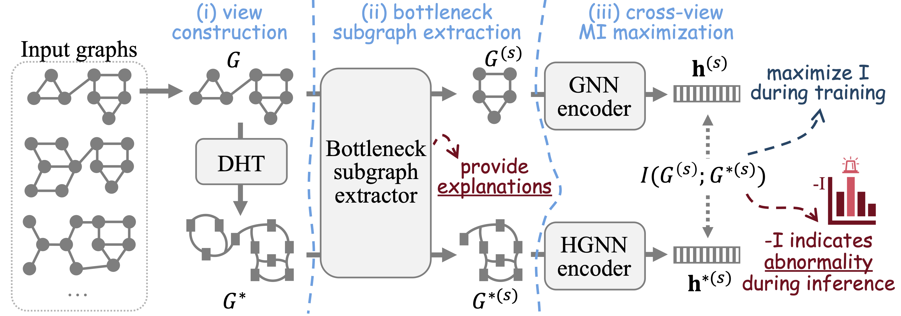

This is the source code of NeurIPS'23 paper "Towards Self-Interpretable Graph-Level Anomaly Detection" (SIGNET).



##Usage##

1. prepare datasets

-- Mutag:
1) Raw data files need to be downloaded at: https://github.com/flyingdoog/PGExplainer/tree/master/dataset
2) Unzip Mutagenicity.zip and Mutagenicity.pkl.zip
3) Put the raw data files in ./data/mutag/raw
-- MNIST:
1) Raw data files need to be generated following the instruction at: https://github.com/bknyaz/graph_attention_pool/blob/master/scripts/mnist_75sp.sh
2) Put the generated files in ./data/mnist/raw
-- Others:
Download and process automatically

2. run script line in scripts.sh

For example:
```
python main.py --dataset AIDS --epoch 1000 --lr 0.0001 --hidden_dim 16
```

##Cite##

## Cite

If you compare with, build on, or use aspects of SIGNET, please cite the following:
```
@inproceedings{liu2023towards,
  title={Towards self-interpretable graph-level anomaly detection},
  author={Liu, Yixin and Ding, Kaize and Lu, Qinghua and Li, Fuyi and Zhang, Leo Yu and Pan, Shirui},
  booktitle={Advances in Neural Information Processing Systems},
  volume={36},
  year={2023}
}
```
